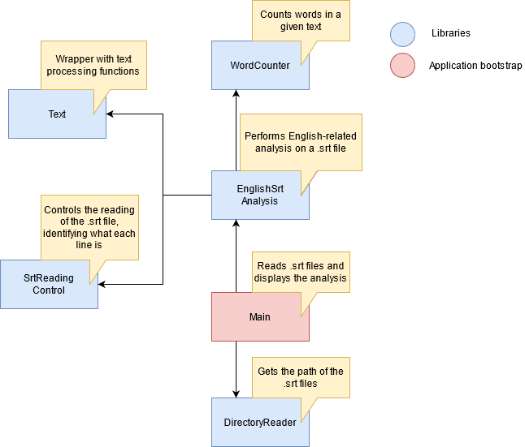

# ENGLISH SRT ANALYSIS

English subtitles analysis program

## Current Features
 
* reports the occurrence of the 30 most used words in the subtitle files

## Dependencies Diagram



## Initial Steps

 - put your srt files inside subtitles folder

## How to Build

```bash
npm run build
```

## How to Run

```bash
npm run start
```

# Tecnologies

* NodeJS
* TypeScript